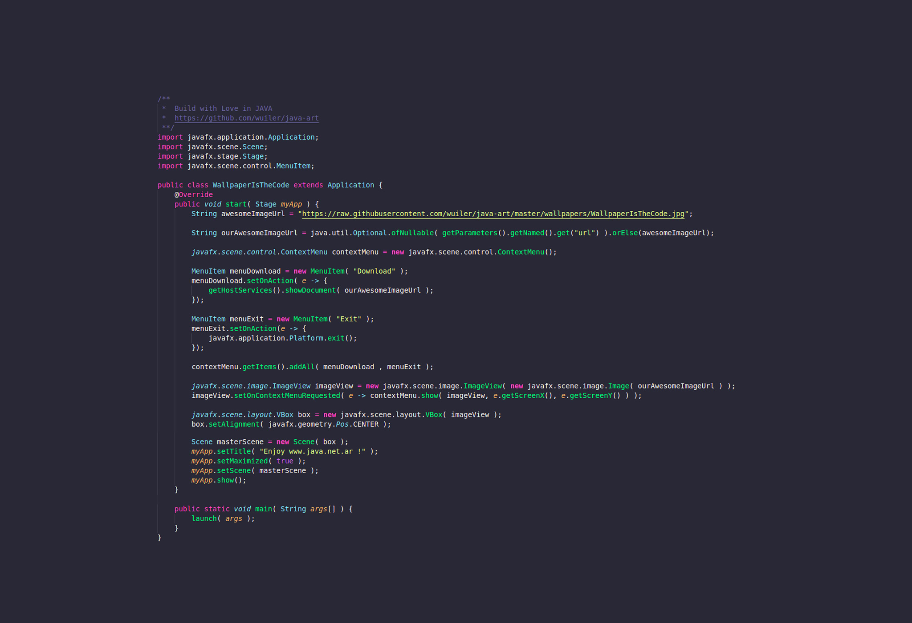
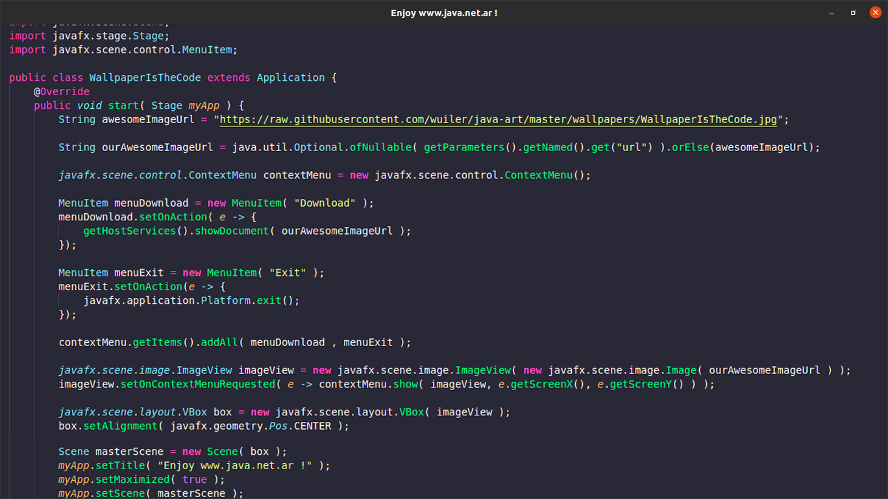

Hoy es ** Viernes de Wallpaper !!! **
Vamos a relajarnos del código y traer algo de amor a nuestro escritorio con algunos fondos de pantalla de Java.
Hice un sitio especial en Github para eso y puedes contribuir en: https://github.com/wuiler/java-art

### Primer diseño
El primer wallpaper que diseñe es para honrar los ...
## 25 años de Java. Feliz Cumple!!!

### Segundo diseño
Aunque dije que nos ibas a relajar del código, el segundo fondo de pantalla que diseño se basa en el código: https://github.com/wuiler/javafx-images  
Creé este ejemplo porque en todas estas ocasiones ví demasiados fondos de pantalla con código adentro, que parecen estar en Java pero no lo están.  
Entonces, esta es una pequeña aplicación JavaFX donde el código se puede "convertir" en el fondo de pantalla y lo es.   
Este es el resultado final del fondo de pantalla.  

## WallpaperTheCode!!  

y esta es la aplicación que crea el fondo de pantalla

¡Espero que lo disfruten!